# 图书馆座位预约小程序(文末免费领取☟)
> 
#### 介绍
图书馆座位预约小程序(Java_SSM_微信小程序)
有BUG可留言加微

#### 软件架构
Java + SSM + 微信小程序 + Mybatis + Mysql

#### 项目功能说明

> + 系统分为管理员、用户两种角色
> + 登录注册
> + 管理员管理、用户角色管理
> + 图书馆管理
> + 座位信息管理
> + 预约选座管理
> + 签到信息管理
> + 签退信息管理
> + 论坛管理
> + 留言反馈
> + 系统管理：关于我们、轮播图管理、系统简介、公告信息

### 部分功能演示

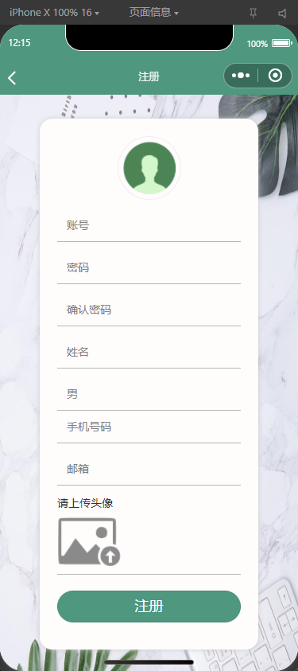
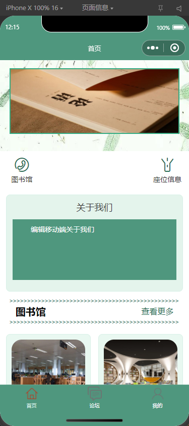

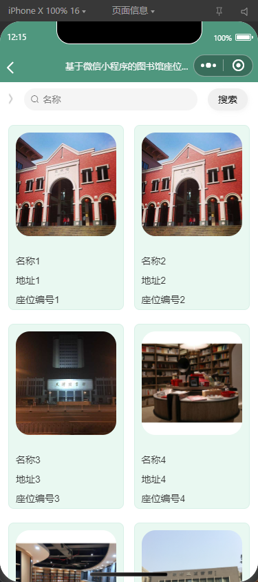

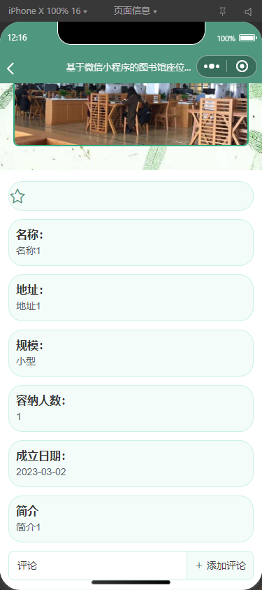

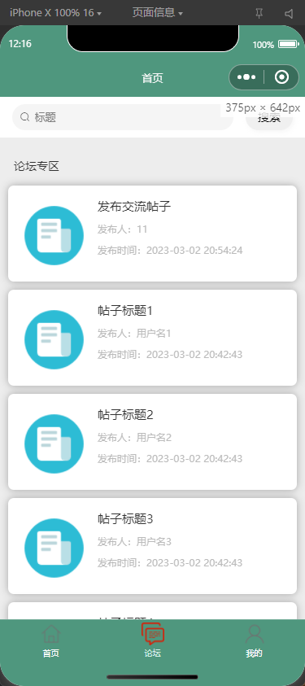
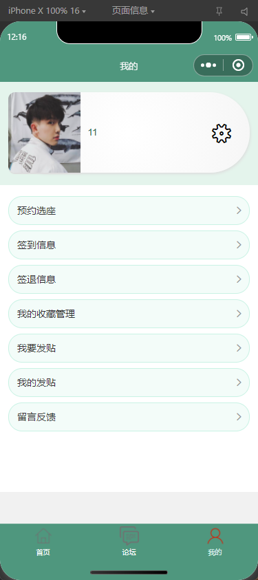

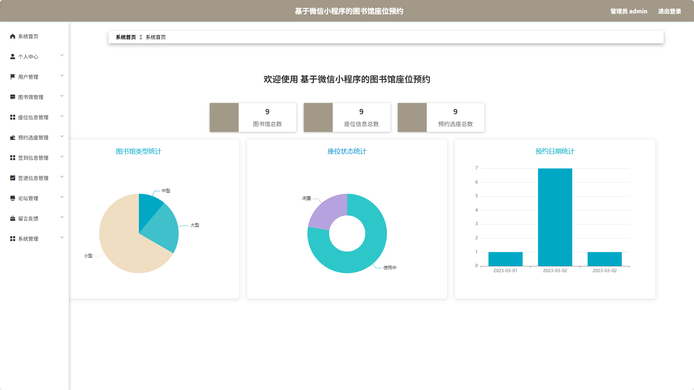
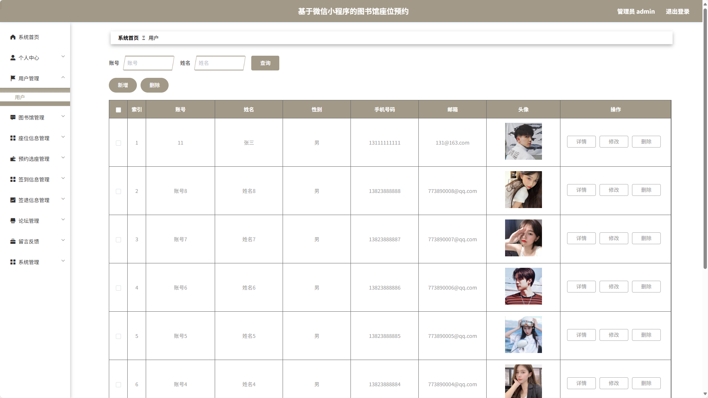
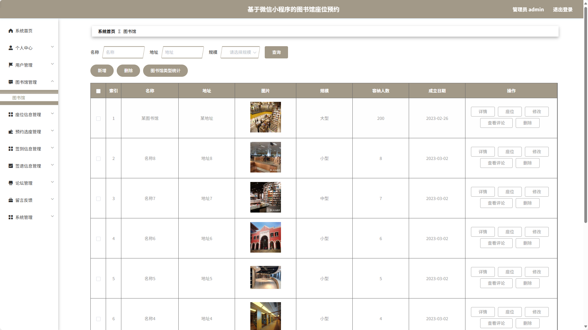
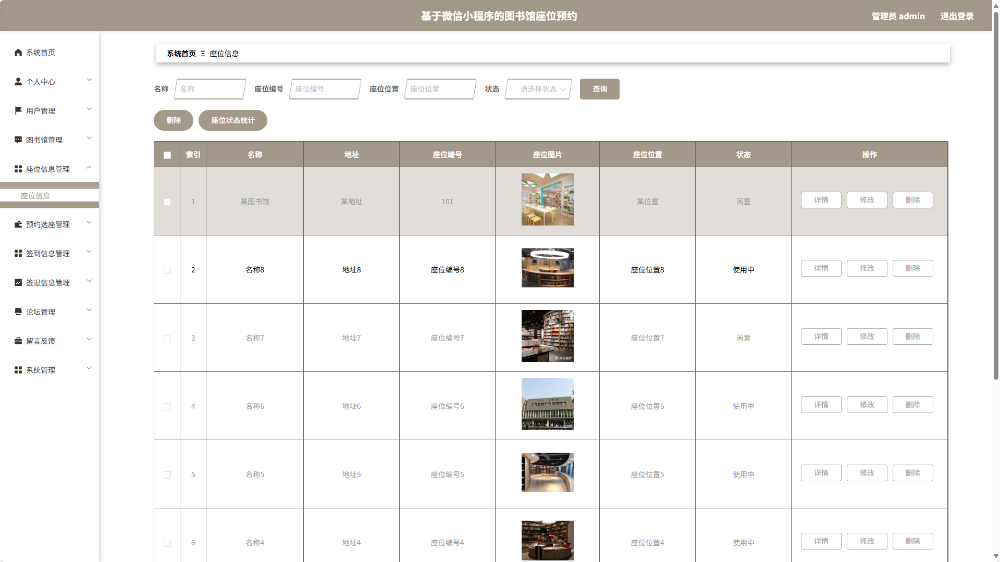
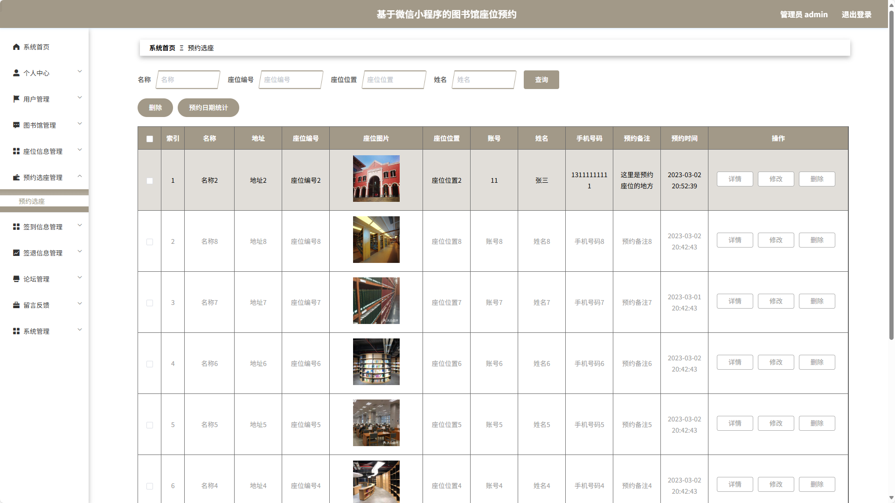
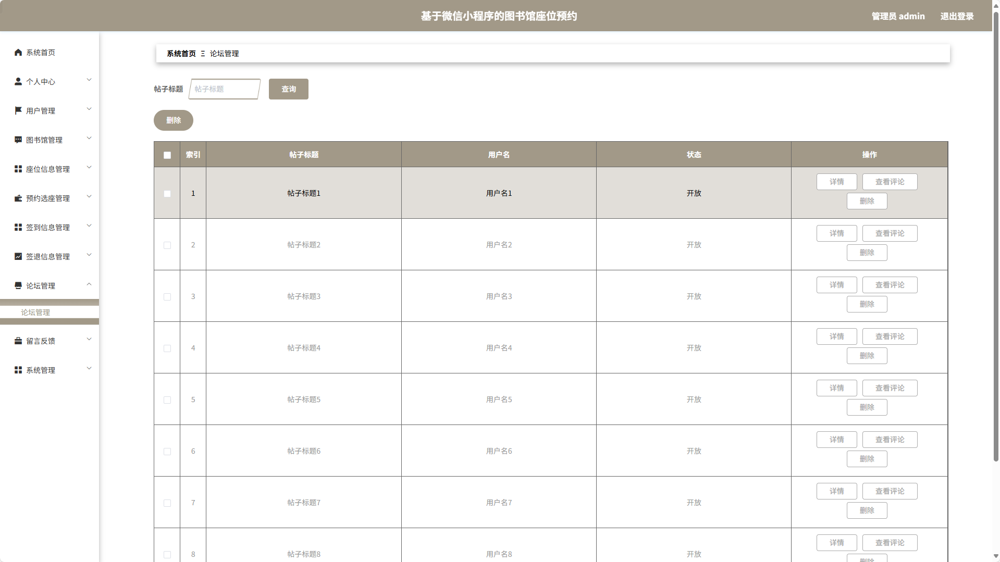
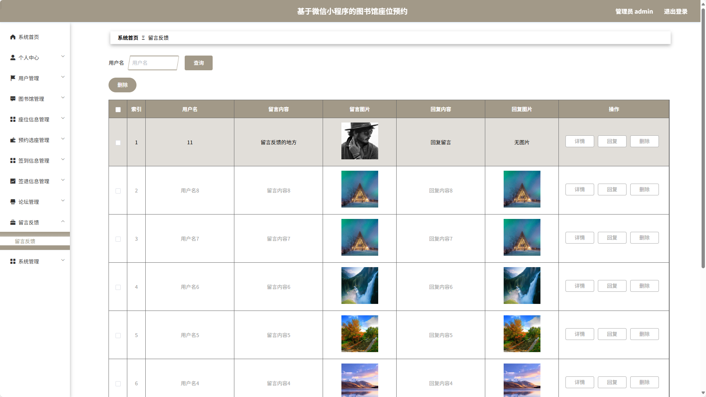
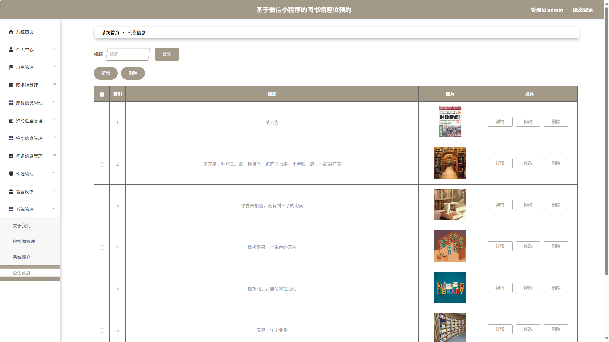

### 环境需求(可免费提供)
- idea/eclipse、jdk-1.8、maven-3.8.6、mysql、node.js等

## 有项目修改、安装调试需求 请联系以下

## 获取资源扫☝☝☝

